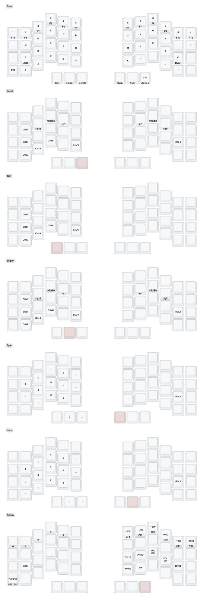

# ZMK configuration

Personal ZMK configuration repository, currently containing custom firmware
for a 54-key Bridges V2 with dual PAW3222 trackballs. The layout is
Colemak-DH and combines Miryoku-style layers with Urob-style "timeless"
home-row mods.

## Base layout

- Number row: tap `` ` ``, `1`-`0`, `=`; the number keys hold `F1`-`F10`,
  grave holds `F11`, and equals holds `F12`.
- Home-row mod-taps:
  - left: `A/GUI`, `R/Alt`, `S/Ctrl`, `T/Shift`
  - right: `N/Shift`, `E/Ctrl`, `I/Alt`, `O/GUI`
- The mod-taps use positional, balanced "timeless" settings. Pointer layers
  use immediate modifiers in the same positions.
- Thumbs: `Esc/Text`, `Space/Sniper`, `Tab/Scroll`, `Enter/Sym`,
  `Backspace/Num`, `Delete/Admin`.
- The left outer-bottom key emits `F23` for host-side application bindings;
  the right outer-bottom key is backslash/pipe.

## Current pointing setup

The right trackball provides the layer-controlled modes below. The left
trackball is a dedicated always-on adaptive scroll device with a keypress guard
that briefly suppresses movement after physical key presses to reject typing
vibration without imposing a scroll dead zone.

| State | Behavior |
| --- | --- |
| Default | Cursor; ordinary typing keys are never remapped automatically |
| Hold Tab | Coalesced adaptive vertical/horizontal scrolling |
| Hold Esc | Trackball arrows; physical `N/E/I/O` are left/down/up/right |
| Hold Space | Quarter-speed cursor with the mirrored click keys |

The left trackball remains adaptive scroll in every state, including while a
right-trackball mode is held. Holding Tab therefore makes both balls scroll.
Its gain is calibrated independently because equal repeated gestures produced
substantially less raw distance with the left hand.

Text, Scroll, and Sniper also provide `Q/Z/X/C/V` as
Redo/Undo/Cut/Copy/Paste. Held Shift combines with those shortcuts for terminal
copy/paste. Text uses only the left home-row modifiers and disables unrelated
keys.

Hold Enter or Backspace for stripped canonical Miryoku Sym and Num layers.
Hold Delete for Bluetooth profiles, media controls, USB/BLE output toggle,
and persistent right-trackball CPI presets.

### Admin controls

- Left number row: Bluetooth profiles 0-4 and clear.
- Right number row: approximately 600/700/800/900/1000/1200 CPI (the exact
  PAW3222 values are 608/684/798/912/988/1216).
- Right home: mute, previous, volume down/up, and next.
- Right bottom: stop and play/pause.
- Left outer-bottom key: output toggle.

The dual-role thumbs support tap-then-hold repeat: for example, tap Backspace
and quickly hold it to repeat Backspace instead of opening Num.

## Compiled tuning values

Edit `config/bridges_v2.keymap`:

- home-row mod timing: `tapping-term-ms`, `quick-tap-ms`, and
  `require-prior-idle-ms` in `lhm`/`rhm`
- Text movement thresholds: `horizontal-threshold` and `vertical-threshold`
  on `zpt_text_nav` (lower is faster)
- Text gesture classification: `activation-distance`,
  `engage-ratio-percent`, and `idle-timeout-ms` on `zpt_text_nav`
- scroll speed: `scale-multiplier` / `scale-divisor` on `zpt_right_scroll`
- scroll coalescing: `report-interval-ms` on `zpt_right_scroll`
- adaptive axis intent: `engage-ratio-percent`, `release-ratio-percent`, and
  `intent-window-ms` on `zpt_right_scroll`
- sniper speed: `&zip_xy_scaler 1 4`

The scroll values above, text-navigation thresholds and axis settings, and the
left-trackball physical keypress guard can also be previewed at runtime from
the local tuner. Runtime previews are validated and held only in RAM; reset
them from the page or reboot to restore these Git-tracked defaults. The left
guard currently defaults to the tested 40 ms threshold.

The current tested Text defaults are 75-count horizontal and vertical steps,
35-count activation distance, a 150% engage ratio, and a 40 ms idle timeout.

The reusable Scroll and Text processors live in the separately pinned
`zmk-pointing-tools` module. Text locks one physical axis for each gesture;
its independent step thresholds no longer bias that initial axis decision.

## Pointing telemetry and runtime tuning

The central firmware advertises raw and processed streams plus temporary
scroll, text-navigation, and right-cursor noise-filter tuning targets through
`zmk-pointing-tools`. The cursor filter is compiled in pass-through mode so it
can first be enabled and evaluated without changing the default pointer
behavior. Connect the right half over USB, then run the local tuner from a
sibling checkout:

```console
cd ../zmk-pointing-tools
devenv up
```

Open <http://localhost:8787> in desktop Chrome. The page discovers `Left
scroll`, `Right scroll`, `Text navigation`, and `Right cursor noise filter`
independently. It can preview
scroll scale/filtering, text step distances, axis intent, timing, and the
keypress guard. Stable `tuning-id` values allow versioned profiles to be
exported and imported without depending on boot-time target order. **Copy
config** generates a reviewable devicetree overlay for transferring current
values back into this repository. Profile imports remain temporary and never
write firmware settings to flash. Telemetry is disabled until requested and
automatically stops if its heartbeat disappears; trace sessions can be
exported as JSON. The creator-hosted tuning site uses an older, incompatible
protocol and is no longer required.

## Building

The development environment is managed by Devenv 2.2. With Devenv installed,
trust the repository once to enable native shell activation:

```console
devenv allow
```

Fish normally loads Devenv's activation hook automatically. You can also enter
the environment explicitly with `devenv shell`.

The official ZMK CLI is available as `zmk` for repository management:

```console
zmk keyboard list
zmk module list
zmk code bridges_v2
zmk download
```

Local firmware compilation is performed by West and orchestrated with Devenv
tasks:

```console
# Initialize or update the pinned West workspace.
devenv tasks run firmware:workspace:sync

# Build one target.
devenv tasks run firmware:build:bridges:left
devenv tasks run firmware:build:bridges:right

# Build every Bridges target, including the manual settings-reset images.
devenv tasks run firmware:build:bridges

# Regenerate or verify the keymap drawing.
devenv tasks run keymap:draw
devenv tasks run keymap:check

# Run generated-file, repository, and toolchain validation without compiling.
devenv tasks run firmware:validate

# Run the complete parallel build and validation graph.
devenv test --no-tui
```

Firmware is collected in `firmware/`, with separate build directories under
`.build/`. The out-of-tree West checkout is stored in `.west-workspace/` so it
does not conflict with this repository's own `zephyr/module.yml`.

`config/west.yml` pins ZMK, Zephyr, the independent Bridges board fork,
`zmk-pointing-tools`, and the transitional trackball modules to exact commits.
Its Zephyr import is restricted to the modules used by the nRF52840 Bridges
hardware. `devenv.lock` separately pins the local Nix toolchain and development
utilities.

Pull requests and pushes to `main` build the two production images in
`build.yaml` through the pinned Nix-based `urob/zmk-actions` workflow. The reset
images in `build-reset.yaml` and the official ZMK fallback are separate manual
workflows. Devenv remains the local source of truth; its full build is tested in
CI only when the environment or local build scripts change.

The current generated keymap is shown below.


